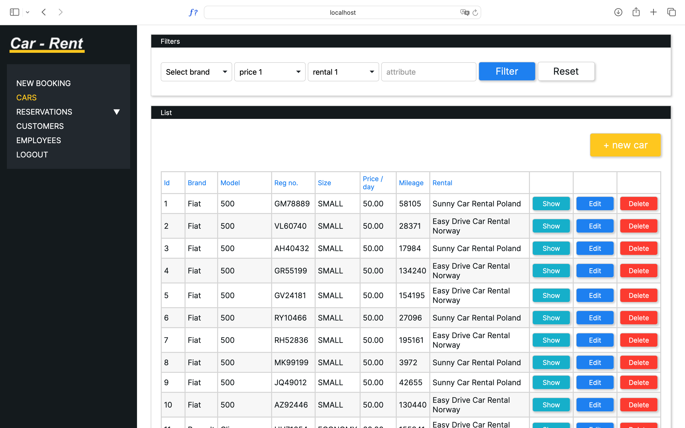

# Car-rental

Application is a system for managing car rental services. It consists of two modules, the first of which enables users to browse available vehicles and make reservations, while the second is for managing data about reservations, vehicles, and customers.

System ensures the security of customer data through the use of appropriate authentication and authorization mechanisms, as well as data encryption.

  
**Check how the app works by clicking on the [link](http://carrental.vps.webdock.cloud:8080).**

**User view:** 

- browse cars from different rent companies,
- manage your booking,
- create your account.

_login: user@gmail.com
password: user_

**Employee view:** 

- manage cars (add, delete, update),
- manage reservations (add, delete, start, finish),
- manage customers.

_login: employee@gmail.com
password: employee_

**Admin view:** 
- manage rental companies (create, delete)

_login: admin@gmail.com
password: admin_

